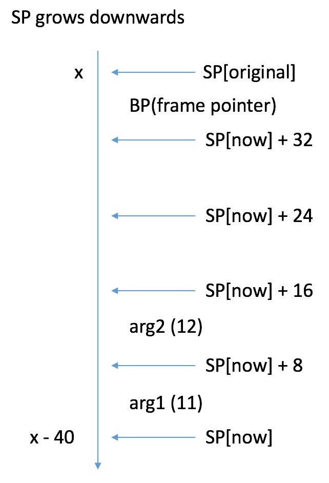

# 简介

本小节通过几个demo, 来让大家熟悉:
1. go的伪汇编语法;
2. go的调用栈细节;

# 最简单的汇编代码

直接看一段简单的代码:

```
package main

//go:noinline
func cal(a, b int64) (int64, int64) { return a + b, 2345 }

func main() { cal(11, 12) }
```

利用指令:
```
go tool compile -S main.go
```
可拿到其汇编后的伪代码;

我们省略一些复杂的语句, 其主干部分大致如下:

```
"".cal STEXT nosplit size=28 args=0x20 locals=0x0
	0x0000 00000 (main.go:4)	TEXT	"".cal(SB), NOSPLIT, $0-32
	0x0000 00000 (main.go:4)	MOVQ	"".b+16(SP), AX
	0x0005 00005 (main.go:4)	MOVQ	"".a+8(SP), CX
	0x000a 00010 (main.go:4)	ADDQ	CX, AX
	0x000d 00013 (main.go:4)	MOVQ	AX, "".~r2+24(SP)
	0x0012 00018 (main.go:4)	MOVQ	$2345, "".~r3+32(SP)
	0x001b 00027 (main.go:4)	RET

"".main STEXT size=68 args=0x0 locals=0x28
	0x0000 00000 (main.go:6)	TEXT	"".main(SB), $40-0
    ...
	0x000f 00015 (main.go:6)	SUBQ	$40, SP
	0x0013 00019 (main.go:6)	MOVQ	BP, 32(SP)
	0x0018 00024 (main.go:6)	LEAQ	32(SP), BP
	0x001d 00029 (main.go:6)	MOVQ	$11, (SP)
	0x0025 00037 (main.go:6)	MOVQ	$12, 8(SP)
	0x002e 00046 (main.go:6)	CALL	"".cal(SB)
    ...
```

下面稍微详细看一下这几句话;

### 函数声明
```
"".cal STEXT nosplit size=28 args=0x20 locals=0x0
	0x0000 00000 (main.go:4)	TEXT	"".cal(SB), NOSPLIT, $0-32

"".main STEXT size=68 args=0x0 locals=0x28
	0x0000 00000 (main.go:6)	TEXT	"".main(SB), $40-0
```
分别申明了两个方法;

cal最右边的"$0-32", 分别表示他需要的栈空间大小和入参空间大小;

同理, main最右边的"$40-0", 表示main这个函数需要40bytes的栈空间, 0bytes的入参空间;

### main
现在详细看想下main;

```
	0x000f 00015 (main.go:6)	SUBQ	$40, SP
	0x0013 00019 (main.go:6)	MOVQ	BP, 32(SP)
	0x0018 00024 (main.go:6)	LEAQ	32(SP), BP
	0x001d 00029 (main.go:6)	MOVQ	$11, (SP)
	0x0025 00037 (main.go:6)	MOVQ	$12, 8(SP)
	0x002e 00046 (main.go:6)	CALL	"".cal(SB)
```

你需要时刻铭记, 栈指针是负增长的, 所以"SUBQ $40, SP"实际上是扩充了40bytes的栈空间, 正好和main声明中的40吻合;

接下来依次把BP, 11, 12放到如下图的位置;



<b>NOTE: 其中BP是frame pointer, 记录的是此函数被调用时, 栈开始的位置, 因为不是重点就不延伸讲解, 具体可看: https://en.wikipedia.org/wiki/Call_stack;</b>


https://github.com/teh-cmc/go-internals/tree/master/chapter1_assembly_primer