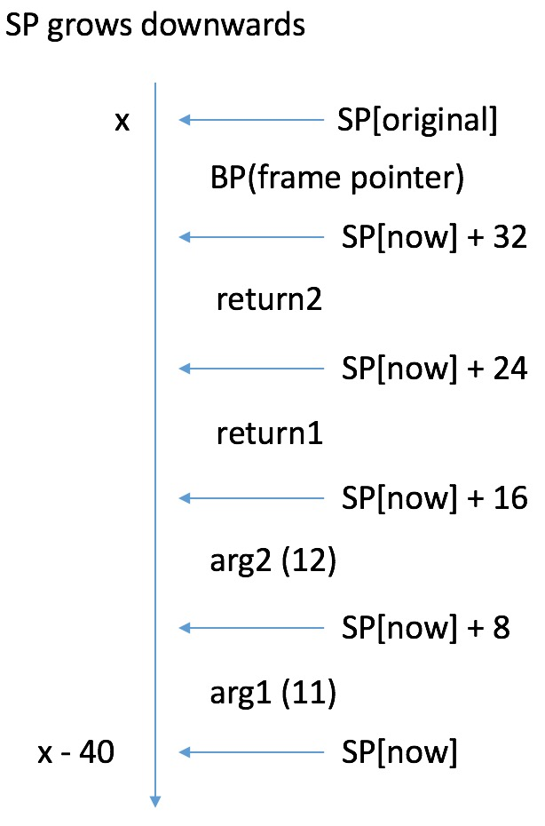
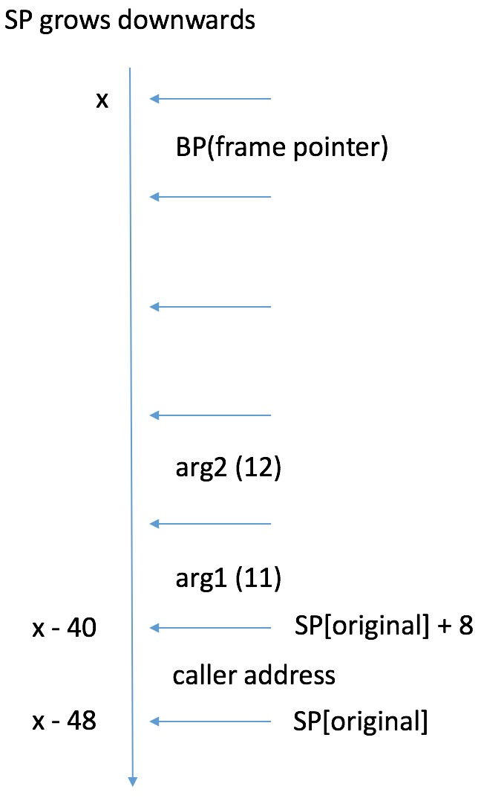
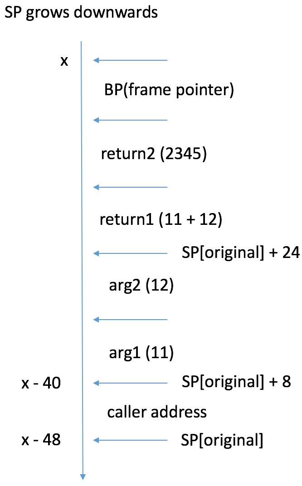

# 简介
本小节通过几个demo, 来让大家熟悉:
1. go的伪汇编语法;
2. go的调用栈细节;

TODO(why need to learn this)

# 最简单的汇编代码

直接看一段简单的代码:

```
package main

//go:noinline
func cal(a, b int64) (int64, int64) { return a + b, 2345 }

func main() { cal(11, 12) }
```

利用指令:
```
go tool compile -S main.go
```
可拿到其汇编后的伪代码;

我们省略一些复杂的语句, 其主干部分大致如下:

```
"".cal STEXT nosplit size=28 args=0x20 locals=0x0
	0x0000 00000 (main.go:4)	TEXT	"".cal(SB), NOSPLIT, $0-32
	0x0000 00000 (main.go:4)	MOVQ	"".b+16(SP), AX
	0x0005 00005 (main.go:4)	MOVQ	"".a+8(SP), CX
	0x000a 00010 (main.go:4)	ADDQ	CX, AX
	0x000d 00013 (main.go:4)	MOVQ	AX, "".~r2+24(SP)
	0x0012 00018 (main.go:4)	MOVQ	$2345, "".~r3+32(SP)
	0x001b 00027 (main.go:4)	RET

"".main STEXT size=68 args=0x0 locals=0x28
	0x0000 00000 (main.go:6)	TEXT	"".main(SB), $40-0
    ...
	0x000f 00015 (main.go:6)	SUBQ	$40, SP
	0x0013 00019 (main.go:6)	MOVQ	BP, 32(SP)
	0x0018 00024 (main.go:6)	LEAQ	32(SP), BP
	0x001d 00029 (main.go:6)	MOVQ	$11, (SP)
	0x0025 00037 (main.go:6)	MOVQ	$12, 8(SP)
	0x002e 00046 (main.go:6)	CALL	"".cal(SB)
    ...
```

下面稍微详细看一下这几句话;

### 函数声明
```
"".cal STEXT nosplit size=28 args=0x20 locals=0x0
	0x0000 00000 (main.go:4)	TEXT	"".cal(SB), NOSPLIT, $0-32

"".main STEXT size=68 args=0x0 locals=0x28
	0x0000 00000 (main.go:6)	TEXT	"".main(SB), $40-0
```
分别申明了两个方法;

cal最右边的"$0-32", 分别表示他需要的栈空间大小和参数空间大小, 参数空间同时包含入参和出参;

同理, main最右边的"$40-0", 表示main这个函数需要40bytes的栈空间, 0bytes的参数空间;

### main
现在详细看下main;

main的主要操作就是为调用cal做准备;

```
	0x000f 00015 (main.go:6)	SUBQ	$40, SP
	0x0013 00019 (main.go:6)	MOVQ	BP, 32(SP)
	0x0018 00024 (main.go:6)	LEAQ	32(SP), BP
	0x001d 00029 (main.go:6)	MOVQ	$11, (SP)
	0x0025 00037 (main.go:6)	MOVQ	$12, 8(SP)
	0x002e 00046 (main.go:6)	CALL	"".cal(SB)
```

你需要时刻铭记, 栈指针是负增长的, 所以"SUBQ $40, SP"实际上是扩充了40bytes的栈空间, 正好和main声明中的40吻合;

接下来依次把BP, 11, 12放到如下图的位置;


<b>NOTE: 其中BP是frame pointer, 记录的是此函数被调用时, 栈开始的位置, 因为不是重点就不延伸讲解, 具体可看: https://en.wikipedia.org/wiki/Call_stack;</b>

SP[original]是main开始时的SP位置, SP[now]是扩展后的位置;

可以看到 [SP[now]+16, SP[now]+32) 是空的, 他们会被用来存放cal的返回值;

调用cal之后的栈将会如下:



### cal
根据汇编CALL的语义, 在执行CALL时, 先将当前PC压栈, 然后再修改当前PC到调用代码段的地址, 完成跳转;

于是, 在进入cal时, 真实的调用栈大概如下:



对照cal内的汇编代码:

```
	0x0000 00000 (main.go:4)	MOVQ	"".b+16(SP), AX
	0x0005 00005 (main.go:4)	MOVQ	"".a+8(SP), CX
	0x000a 00010 (main.go:4)	ADDQ	CX, AX
	0x000d 00013 (main.go:4)	MOVQ	AX, "".~r2+24(SP)
	0x0012 00018 (main.go:4)	MOVQ	$2345, "".~r3+32(SP)
```

得出返回前的调用栈如下:



根据RET的语义, 将栈顶存的PC地址取出来, 再修改当前PC寄存器, 完成函数返回;

https://github.com/teh-cmc/go-internals/tree/master/chapter1_assembly_primer

# 访问结构体
再来看一个demo, 如下:
```
package main

type MyStruct struct {
	Field1 int64
	Field2 int64
}

//go:noinline
func accessStruct(st *MyStruct) (int64, int64) {
	return st.Field1, st.Field2
}
```

可拿到accessStruct的汇编主干代码大概如下:
```
"".accessStruct STEXT nosplit size=23 args=0x18 locals=0x0
	0x0000 00000 (main.go:9)	TEXT	"".accessStruct(SB), NOSPLIT, $0-24
	0x0000 00000 (main.go:9)	MOVQ	"".st+8(SP), AX
	0x0005 00005 (main.go:10)	MOVQ	(AX), CX
	0x0008 00008 (main.go:10)	MOVQ	8(AX), AX
	0x000c 00012 (main.go:10)	MOVQ	CX, "".~r1+16(SP)
	0x0011 00017 (main.go:10)	MOVQ	AX, "".~r2+24(SP)
	0x0016 00022 (main.go:10)	RET
```

因为我的机器是64位, 所以一个指针需要的大小为8bytes, 再加上2个int64的返回值, 所以该函数需要24的参数空间, 正如"$0-24"所示;

0(SP)被用来存储返回地址, 如上文CALL语义, 因此st的指针位置在8(SP), 如 MOVQ	"".st+8(SP), AX 所示;

"MOVQ	(AX), CX" 表示把AX当做开始地址的前8bytes读入CX, 也就是读取Field1;

"8(AX), AX" 同理, 读取Field2;

最后是把Field1和Field2分别填入到返回位置的栈空间, 然后Return;

# 其他资料
https://golang.org/doc/asm

https://github.com/teh-cmc/go-internals/tree/master/chapter1_assembly_primer